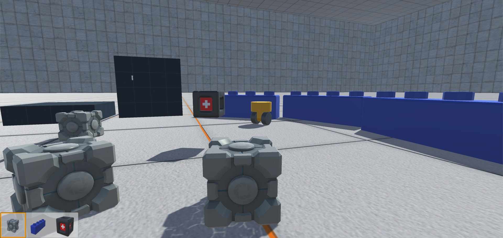

# Robot Sapiens

_François Suro, Thibaut Castanié, Vincent Bazia_ - M2 IMAGINA

# Contenu du dépôt

- Rapport et présentation : [Rapport](./Rapport)
- Serveur java : [RoboSapiens BrainServeur v2](./robosapiensBrainServ_2)
- Projet Unity : [UnityProject](./RobosapiensUnityProject)
- Projet de Chapelle _non utilisé_ : [brainServeur](robosapiensBrainServ)
- Sauvegarde des cerveaux des robots : [botBrains](./robosapiensBrainServ_2/botBrains/)

# Manuel d'utilisation

- Lancer le serveur Java 
- 2 cas :
    + pour lancer un nouvel apprentissage de cerveau, supprimer ou déplacer tous les dossiers contenus dans _botBrains_
    + sinon laisser les dossiers ou copier dans _botBrains_ le contenu du dossier _save_ (ne pas utiliser les saves _T2_ ou _type2_)
- Ouvrir le projet Unity
- Ouvrir la scène _TestScene1-Francois.unity_
- Lancer le jeu en cliquant sur le _Play_ d'Unity

----

